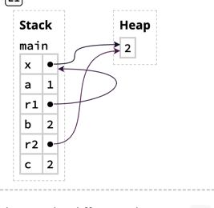

# Rust 学习笔记

## 编译配置

### rust 命令

```shell
# 查看当前的 rust 版本
rustc --version
# 升级 rust 
rustc update
# 编译一个 rust 文件
rustc main.rs
# 查看 文档
rustup doc
```

### cargo 命令

```shell
# 创建一个项目, hello-rust 是项目名称，项目名称遵循 xxx-xxx 原则，字母都用小写字母 
carg new hello-rust --vcs=git
# 编译一个项目, 编译之后会生成一个 debug 的目录，进入该目录之后就可以运行
# 如果需要编译 release 的，可以使用 -help 查看帮助，默认编译的是 debug
cargo build
# 运行一个项目
cargo run 
# 运行时检查一个项目情况
# check 命令要比 run 快，因为它不需要运行，如果项目非常大，需要编译很久才能运行，而稍微有点错误
# 就会导致运行失败，使用 run 命令就会让人抓狂，check 命令就能改善这种情况
cargo check 
```

## 项目结构

下面展示了一个简单的项目结构：<br>

```
.
├── Cargo.lock // 当前项目与第三方的版本配置，通常这个也会加入到 git 版本控制中，因为有的项目可能需要特定的版本才能编译
├── Cargo.toml // 当前项目与第三方的版本配置, 与 lock 不同，这里是配置的地方
├── readme.md // 项目说明
├── src // 项目源码存放位置
│   └── main.rs // 项目源代码
└── target // 编译后的目录存放位置，通常该文件不会加入到 git 版本控制中
    ├── CACHEDIR.TAG 
    └── debug // 上面提到的 cargo build 后的产物就存在当前目录下
        ├── build
        ├── deps
        ├── examples
        └── incremental
```

### Cargo.toml 配置文件详解

```toml
[package]
name = "hello_cargo" # 当前项目名称
version = "0.1.0" # 当前项目版本
edition = "2021" # 修改时间

# See more keys and their definitions at https://doc.rust-lang.org/cargo/reference/manifest.html

[dependencies]
rand = "0.8.5" # 表示用了一个 rand 第三方库，版本是 0.8.5
# 添加完之后，使用 cargo build 就可以把该第三方的以及它关联的第三方都拉下来，并存储到 .lock 文件中

# 使用非固定版本
#rand = "^0.8.5" # 表示用最新的0.8.x 版本，该版本始终小于 0.9.0 
#前面说了 .lock 文件会将第三方版本版本锁定在某个版本，例如 0.8.6， 过了一段时间后，该第三方库的作者
#发布了 0.8.7， 项目不会自动更新到该版本，尽管使用了 ^, 要想主动更新，可是使用：cargo update 来更新
#注意，如果有更新，会同步想改 .lock 文件锁定的版本
```

### Cargo.lock 版本详解

该文件不需要手动编辑，会自动根据环境生成，

```toml
# This file is automatically @generated by Cargo.
# It is not intended for manual editing.
version = 3

[[package]]
name = "hello_cargo" # 项目名称
version = "0.1.0" # 项目版本
dependencies = [ # 当前项目依赖的第三方
 "rand",
]

[[package]]
name = "rand" # 依赖的第三方
version = "0.8.5" # 版本
source = "registry+https://github.com/rust-lang/crates.io-index" # 源码地址
checksum = "34af8d1a0e25924bc5b7c43c079c942339d8f0a8b57c39049bef581b46327404"
dependencies = [ # 该第三方又依赖了其他的第三方
    "libc",
    "rand_chacha",
    "rand_core",
]
#... 还有很多 ...
```

## 编码前提

这里说一下编码的基础情况

```rust
// 使用  use 导入某个包， :: 两个冒号来表示引用某个类
use std::io;
fn main(){ // fn 表示函数， main() 表示项目的入口
    let guess = "123";
    println!("You guessed: {guess}"); // println! 输出, {} 来引入变量
    println!("You guessed: {}", guess); // 也可以这么写

    io::stdin() // 输入
        .read_line(&mut guess)
        .expect("Failed to read line"); // 错误捕捉

    let guess: u32 = match guess.trim().parse() { // 错误捕捉 返回一个 Ok 与 Err, Ok 里面有正确的值
        Ok(num) => num, 
        Err(_) => println!("error"),
    };
}
```

## 变量与类型

rust 类型编译的时候就已经确定

```rust
let x = 5; // 编译定义了一个变量 x 的类型是 i32， 主要该变量 x 是不可以修改的

x = 10; // 这一行代码会报错，应该默认的 x 是不可以修改的

let mut y = 10; // 使用 mut 来表示 y 是可变的
y = 20; // 可以正确的编译

let mut y = "I am string!"; // 类型覆盖，可以将 y 的类型修改改成 String, 这是运允许的
y = 20; // 报错！ 修改之后 y 就是 String 类型，此时再赋值成 i32 类型就会报错
y = "new String"; // 正确

// 常量， 注意常量不可以被覆盖
const THREE_HOURS_IN_SECONDS: u32 = 60 * 60 * 3;
// let mut THREE_HOURS_IN_SECONDS: u32 = 60 * 60 * 3; // 报错
// println!("new {THREE_HOURS_IN_SECONDS}");
//   |
// 8 |     const THREE_HOURS_IN_SECONDS: u32 = 60 * 60 * 3;
//   |     ------------------------------------------------ the constant `THREE_HOURS_IN_SECONDS` is defined here
// 9 |     let mut THREE_HOURS_IN_SECONDS: u32 = 60 * 60 * 3;
//   |             ^^^^^^^^^^^^^^^^^^^^^^ cannot be named the same as a constant
```

### 整型

i 表示有符号，范围是：-(2n - 1) to 2n - 1 - 1  u 表示无符号， 范围是：0 to 2n - 1 - 1

|Length	|Signed	|Unsigned|
| --- | --- | --- |
|8-bit	|i8	|u8|
|16-bit	|i16	|u16|
|32-bit	|i32	|u32|
|64-bit	|i64	|u64|
|128-bit	|i128	|u128|
|arch	|isize	|usize|

### 浮点型

浮点型比较简单，只有两种类型，分别是 f32 和 f64, 默认类型是 f64, 因为市面上大多数的机器64 位能有 32 位的运行性能

### 计算

计算支持基本的加减乘除与取余操作，但是不支持两个不同类型的直接计算，例如：

```rust
let a = 10;
let b = 20.0;
let c = a * b; // 报错
//   |
//   |     let c = a * b;
//   |               ^ no implementation for `{integer} * {float}`
//   |
//   = help: the trait `Mul<{float}>` is not implemented for `{integer}`
```

### 布尔类型

```rust
let a = true;
let b: bool = false;
```

### char 类型

只允许设置单个字符，它占用 4 个字节，允许使用 ASCII 码，中文，日语，韩语，emoji, zero-width spaces 等等。
一个字符不等于一个 Unicode

```rust
let c = '2';
let d: char = '王';
let e = '😄';
```

### 元组

元组的长度是固定不变的，不可以修改，例如：

```rust
    let t : (f32, f64, u32) = (500.0, 6.4, 1); // 三个元组
let t1 = t.0; // 通过数字下标来访问元组
let t2 = t.1;
let t3 = t.2;

println!("t: {t1}");
println!("t: {}", t.2);

let t : (f32, f64, u32, u64) = (500.0, 6.4, 1, 64); // 四个元组
let t1 = t.0;
let t2 = t.1;
let t3: u32 = t.2;
let t3: u64 = t.3;

let t2 : (f32) = (500.0); // 一个也能组成元组

let t3 = (500.0, 6.4, 1, 64); // 不写类型 的话会自动使用默认的基本类型
```


### 数组

数组与元组不同的是，数组里面的元素必须是同一个类型，例如：

```rust
let a: [i32; 4] = [1, 2, 3, 4]; // 表示一个 int 32 位，长度是 4 的数组
let a = [1, 2, 3, 4]; // 简写：表示一个 int 32 位，长度是 4 的数组
let a = [4; 5]; // 简写 [value; length] ：表示一个 int 32 位，长度是 5， 并且每一个数字都是 4
let size = a.len();
println!("{}, {size}", a[0]); // 通过下标访问某个元素
```


## 函数


```rust
fn main() {
    another_function();
}

fn another_function() {
    // 另外一个函数，函数命名遵循使用下划线命名方法
    println!("Call another function!!")
}


// 传参数
fn main() {
let a = 10;
let b = 30.0;
print_params(a, b);
}

fn print_params(x: i32, y: f64){
    println!("x {x} y:{y}");
}
```

### 返回值

函数如果有返回值，必须使用 -> 类型来声明，例如 -> i32, 返回时，通常使用最后一个值作为返回值，
也可是使用 return 来提前返回

```rust

fn five() -> i32 {
    5
}

fn main() {
    let x = five();
    println!("The value of x is: {x}");
}

fn test_return() {
    return 10; // 报错，函数没有声明返回，函数的返回值不能直接推导出来
}

fn test_return() -> i32 {
    10; // 报错，rust 是表达式语言，最后一个值不能加上；分号
}
```

### 语句与表达式

Rust 是以表达式为基础的，语句会返回值，但是表达式不会，举例子:

```rust
// 区别 1
let a = b = 5; // 报错，在语句中可以，但是在表达式中， b = 5 不会返回任何值

// 区别 2
let mut a = 10;
let b = { // 注意此时 b 没有任何类型
    a = 100;
    a + 10; // 末尾加上了分号，则没有返回任何数据
};
let b = {
    a = 100;
    a + 10 // 没有加分号，则这个值就是 b 的值
};
println!("{b}");
```

## 控制流

### if

条件语句 if, 注意 在条件判断中， else if 与  else 都是可选的

```rust
let a = 10;
if a == 10 { // if
    println!("true");
} else if a > 10 { // else if
    println!("20")
} else { // else
    println!("30")
}
let b = if a == 10 { 2 } else { 30 };
```

if let 语句，可以把枚举里的值解构出来，例如：

```rust
let some_option: Option<i32> = Some(42);
// 使用 if let 解构 Option 枚举
if let Some(number) = some_option {
    println!("Option contains the value: {}", number);
} 
```

### 循环 loop

循环有 loop, for 和 while, loop 类似于 do .. while:

```rust
loop { // 类似于 do .. while
    println!("100");
    break;
}


let a  = loop { // 类似于 do .. while
    println!("100");
    break 10; // 意思是返回最后返回一个 10
};
```


给 loop 添加 label,使用 continue 或 break 的时候，能指定它：

```rust
fn main() {
    let mut count = 0;
    'counting_up: loop { // 给外层的 loop 增加了一个标记 label
        println!("count = {count}");
        let mut remaining = 10;

        loop {
            println!("remaining = {remaining}");
            if remaining == 9 {
                break; // 这里打断的是最近的那个循环，最接近当前语句是得里面的 loop
            }
            if count == 2 {
                break 'counting_up; // 打断指定的 loop
            }
            remaining -= 1;
        }

        count += 1;
    }
    println!("End count = {count}");
}
```

### while
```rust
fn main() {
    let a = [10, 20, 30, 40, 50];
    let mut index = 0;

    while index < 5 {
        println!("the value is: {}", a[index]);

        index += 1;
    }
}
```

### for
```rust
fn main() {
    let a = [10, 20, 30, 40, 50];

    for element in a {
        println!("the value is: {element}");
    }
}
fn main() {
    for number in (1..4).rev() {
        println!("{number}!");
    }
    println!("LIFTOFF!!!");
}
```

### match

类似于 java 的 switch，或者 kotlin 的 when，比较接近 kotlin 的 when，共同点：<br>

* 可以是任意的 key
* 必须穷举所有的条件
* 可以产生返回值

```rust
    let b = 100;
    let a = match b {
        10 => 2,
        20 => 30,
        other => 100,
    };
    println!("{a}");
```


## Ownership: 所有权

### stack 与 heap

stack 符合后进先出的原则，类似于跌盘子，放到这里的数据必须是固定的长度<br>
heap 需要先找到一块合适的内存空间，然后在申请指定的大小<br>


下面例子中，字面量 &str 就是分配在 stack 中，它的大小是可以预知的， String 就是分配在 heap 中的,
因为它可以随时修改

```rust
// 字面量：字面量是不可以修改的
let mut a = "1234"; // &str  字面量
let b = a;
a = "456";
println!("{}, {}", a, b); // 输出 456， 1234

// String 与字面量不同，String 是可以修改的
let mut a = String::from("1234"); // String
a.push_str(" 567");
println!("{}",a); // 输出 1234 567， String 是可以修改的
```

所有的基本类型与字面量， 仅包含基本类型的元组都会被放到 stack 上，因为它们的大小是确定的，其他的类型
则会放到 heap 堆中。

### 所有权规则
1. 每个值都有且仅有一个 owner
2. 在同一个时间也仅能有一个 owner
3. 当 owner 超出范围，对应的值就会被删除 drop

举个例子：

```rust
let s1 = String::from("hello");
let s2 = s1; // 根据规则 1，此时 hello 已经把 hello 所有权从 s1 交给了 s2

// 打印 s1 时， 会报错，因为此时 s1 已经把值借给 s2 了
println!("{}, world!", s1);

```

解决方法，根据报错：

```
   |
88 |     let s1 = String::from("abc"); // 如果s1 的类型是基本类型，或者实现了  `Copy` trait , 则实现的是拷贝值，而不是地址
   |         -- move occurs because `s1` has type `String`, which does not implement the `Copy` trait
89 |     let s2 = s1;
   |              -- value moved here // 值被移动了
90 |     println!("{}", s1);
   |                    ^^ value borrowed here after move // 值被借走了，所以 s1 此时没有值，无法打印
   |
   = note: this error originates in the macro `$crate::format_args_nl` which comes from the expansion of the macro `println` (in Nightly builds, run with -Z macro-backtrace for more info)
help: consider cloning the value if the performance cost is acceptable
   |
89 |     let s2 = s1.clone(); // 解决办法，可以使用拷贝方法，明确告诉编译器，s2 要拷贝值
   |                ++++++++

```

前面说了，基本类型，字面量，进包含基本类型的元组，或者是 实现了  `Copy` trait 的类型，赋值的时候会直接复制的，因为他们的大小是确定的，
而且都比较简单，所以复制或处理他们的效率也是非常高的，当编译器遇到这些类型的时候，会默认选择拷贝值而不是借值

函数也跟变量是一样的：

```rust
fn main() {
    let s1 = String::from("ttt");
    borrow_value(s1);
    // println!("{}", s1);  报错，因为 s1 把值借给 函数 borrow_value 了
}

fn borrow_value(value: String) {
    println!("{}", value);
}
```

### 引用

引用的好处是，当使用复杂对象传递给函数时，借出去的值往往需要通过元组全部返还回来，不然借出去的变量之后就无法访问了。<br>
为了避免这种情况，就使用 & 引用来解决这个问题：

```rust
fn main() {
    let mut s = String::from("hello"); // s 可变
    change(&s); // 引用 reference 传递
    println!("{}", s); // s 可打印
}

fn change(some_string: &String) {
    // some_string 不可变，尽管 s 是可变的，因为 some_string 是引用
    some_string.push_str(", world"); // 报错！！！
}
```

默认引用是不可修改的，如果需要修改，可以写成 &mut xxx:

```rust
fn main() {
    let mut s = String::from("hello"); // s 可变
    change(&mut s); // 引用 reference 传递
    println!("{}", s); // s 可打印
}

fn change(some_string: &mut String) {
    some_string.push_str(", world"); // 这时候就可以修改了
}
```

注意，引用传递在一个范围内只能传递一次，例如：

```rust
let mut s = String::from("hello"); // s 可变
let mut s1 = &mut s;
let mut s2 = &mut s;
println!("{}", s1); // 报错，因为 s 又借给了s2, 所以 s1 没有值
println!("{}", s2); // 正确，最后一个引用可以访问值
```


报错如下：

```
    |
102 |     let mut s1 = &mut s;
    |                  ------ first mutable borrow occurs here
103 |     let mut s2 = &mut s;
    |                  ^^^^^^ second mutable borrow occurs here
104 |     println!("{}", s1); // 报错，因为 s 又借给了s2, 所以 s1 没有值
    |                    -- first borrow later used here
```


同时，rust 禁止一个变量在同一个范围，或同一个时间内，有可变的和不可变的两种引用，例如：

```rust
let mut s = String::from("hello"); // s 可变
let mut s1 = &s; // 不可变引用 &s
let mut s2 = &s; // 不可变引用 &s
let mut s3 = &mut s; // 可变引用 &mut s
println!("{} {} {}", s1, s2, s3);
```

#### 解除引用 * 

```rust
fn main() {
let mut x: Box<i32> = Box::new(1);
let a: i32 = *x;         // *x reads the heap value, so a = 1
*x += 1;                 // *x on the left-side modifies the heap value, 
                         //     so x points to the value 2

let r1: &Box<i32> = &x;  // r1 points to x on the stack
let b: i32 = **r1;       // two dereferences get us to the heap value

let r2: &i32 = &*x;      // r2 points to the heap value directly
let c: i32 = *r2;    // so only one dereference is needed to read it
}
```



首先：
1. a 直接读取了 heap 中的 value，所以 a = 1
2. *x可以直接修改 heap
3. r1 拿到的 x 的引用，所以 r1 = &x
4. b 通过 *r1 访问 r1 heap 中的 value，此时该 value 是 r1 本身，接着再通过 *(*r1) 拿到了 r1 heap 中的 value, 所以此时 b = 2
5. r2 通过 *x 访问 x heap 中的 value, 此时该 value 就是 2，接着再通过 &(*x) 拿到 2 所在的 heap，所以此时 r2 = &i32 = heap 2
6. c 通过 *r2 访问 r2 中的 value，即 c = 2

#### 悬停指针 Dangling References

引用不能超过它自己的生命周期，例如：

```rust
fn dangle() -> &String { // 返回时报错，提示：Missing lifetime specifier [E0106]
    let s = String::from("1234");
    &s
}

//解析：
fn dangle() -> &String { // dangle returns a reference to a String

    let s = String::from("hello"); // s is a new String

    &s // we return a reference to the String, s
} // Here, s goes out of scope, and is dropped. Its memory goes away.
// Danger!

fn dangle(t: &String) -> &String {
    let s = String::from("1234");
    &s // 加上参数编译时报错：^^ returns a reference to data owned by the current function
}
```

&s 超出了自己的生命周期，导致无法编译通过

```rust
fn dangle(t: &String) -> &String {
    let s = String::from("1234");
    &t // 这是可以的，返回的 &t 引用是外部的，没有超出自己的生命周期
}

fn dangle() -> String { // 直接返回变量本身即可
    let s = String::from("1234");
    s
}
```


## 切片 slices
slice 是 reference 的一部门，字面量 &str 就是切片，考虑下面的代码：

```rust
fn first_word(s: &String) -> usize {
    let bytes = s.as_bytes();

    for (i, &item) in bytes.iter().enumerate() {
        if item == b' ' {
            return i;
        }
    }

    s.len()
}
fn main() {
    let mut s = String::from("hello world");

    let word = first_word(&s); // word will get the value 5

    s.clear(); // this empties the String, making it equal to ""
    
    println!("{}", word);
    // word still has the value 5 here, but there's no more string that
    // we could meaningfully use the value 5 with. word is now totally invalid!
}
```

上面的例子，如果 s 被修改了，但是 word 仍然是指向 5，这个时候已经不对了，所以我们需要用切片，引用它的一段，如果那一段变化了，那它也
会跟着变化，例如：

```rust
let mut s = String::from("hello world");

let word = first_word(&s); // word will get the value 5
let hello = &s[0..5];
let world = &s[6..11];
println!("{} {} {}", word, hello, world);

s.clear(); // error, 因为 s 已经借了，所以无法执行 clear 操作
println!("{} {} {}",word, hello, world);
```

## 结构体

使用 struct 来定义一个结构体:

```rust
fn main(){
    let mut user1 = User {
        id: 10,
        email_address: String::from("abc@gmail.com"), // 字段的顺序可以和结构体的顺序不同
        name: String::from("William"),
        password: String::from("123455"),
    };

    user1.id = 20;
    println!("{}", user1.name);
    println!("{}", user1.password);

    let mut user2 = User {
        name: String::from("siyehua"),
        ..user1 // 被复制的对象必须卸载最后面
    };
    println!("{}", user1.name);
    // println!("{}", user1.password);// 报错，因为 password 的值已经借给 user2 了

}

struct User {// 定义了四个字段
    id: u32,
    name: String,
    password: String,
    email_address: String,
}
```

也可以定义 tuple structs 元组结构体, 元组结构体与普通结构的区别是，它不需要给出字段命名。<br>
注意，相同结构的元组不能相互复制，尽管他们的字段是一样的，这点和 ts/js 是不同的

```rust
fn main(){
    let tuple1 = MyTuple1(10, 20.0, String::from("123234"));
    let tuple2 = MyTuple2(10, String::from("123234"), 20.0);
    println!("{}", tuple1.0);
}

struct MyTuple1(i32, f32, String);

struct MyTuple2(i32, String, f32);
```


### 单元结构体 Unit-like Struct 

单元结构体就是一个标记，它的作用类似于一个没有任何方法的接口，这样我们可以将实现不同的单元结构的对象放在同一个数组里，这样我估计是为了更好的
支持泛型等类型，后面我们会学到，这里我们只需要记住：

`单元结构体就是没有任何字段的结构体`

```rust
struct AlwaysEqual;

fn main() {
    let subject = AlwaysEqual;
}
```

打印结构体，默认结构体是不能打印的，可以这么修改：

```rust
fn main(){
    let mylocation = MyLocation {
        x: 10,
        y: 20,
        name: String::from("William"),
    };
    println!("{:#?}", mylocation);
    println!("{:?}", mylocation);
    dbg!(&mylocation);
}

#[derive(Debug)] // 这里必须标记才能打印
struct MyLocation {
    x: i32,
    y: i32,
    name: String,
}
```

## 函数与方法

方法：写在结构体，枚举或 trait 中，第一个参数必须是对象本身。也就是说，方法一定是某个实例的方法<br>， 使用 `obj.function_name()` 调用<br>
函数：不需要对象就可以调用，使用 `MyClass::function_name()` 调用<br>

以上面的例子为例，给它写一个方法

```rust
fn main(){
    let mylocation = MyLocation {
        x: 10,
        y: 20,
        name: String::from("William"),
    };
    println!("{:#?}", mylocation);
    println!("{:?}", mylocation);
    dbg!(&mylocation);
    
    mylocation.show_location();
    let mylocation = MyLocation::create_same(40);
    print!("x {} y {}", mylocation.x, mylocation.y);
}

impl MyLocation {
    fn show_location(&self) { // 方法
        println!("x: {}, y: {}", self.x, self.y);
    }

    fn create_same(size: i32) -> Self { // 函数
        return Self {
            x: size,
            y: size,
            name: String::from("same size"),
        };
    }
}
```

## 枚举 Enum

使用枚举更加方便，可以多多个不同的结构体关联起来，例如, 性别有男，女，使用 struct 是这么定义的；

```rust
fn main(){
    let a = Woman {
        name: String::from("Lisa"),
    };
    let b = Man {
        name: String::from("Ben"),
    };
}

struct Woman {
    name: String,
}

struct Man {
    name: String,
}
```

这个时候，为了统一 name 属性，需要使用 `traits` 来统一，很麻烦，为了解决这个问题，可以使用枚举：

```rust
fn main(){
    let a = Person::MAN(String::from("Ben"));
    let b = Person::WOMAN(String::from("Lisa"));
}

enum Person {
    MAN(String),
    WOMAN(String),
}
```

另外，枚举支持每一个枚举值都可以使用不同的参数：

```rust
enum MyEnum {
    TYPE1(i32),
    TYPE2(String),
    TYPE3,
}
```

## 管理 project
package, crate, module 之前的关系:<br>
package = project, package 里面可以有多个 crate<br>
crate = library, 包括 binary crate :main.rs, lib crate: lib.rs, 以及每个目录下单独的 lib crate<br>
module 包含在 crate 中，使用 mod 来定义, module 就是某个功能模块

```
foobar //整一个叫 package
├── Cargo.toml
├── build.rs
└── src/
    ├── main.rs // binary crate
    ├── util.rs
    ├── lib.rs // lib crate
    └── bin/
        └── alt.rs // binary crate
```


### module

上面的目录结构展示了 package 和 crate ，但是没有包含 module，module 通常在 crate中，以下是一个定义在 main.rs 中的例子：

```rust
pub mod custom_mod {
    // 这里定义了一个 module
}
fn main(){
    
}
```

cargo 会用下面三种方法查找：
1. 首先在 mod custom_mod 后来看看有没有点大括号包裹的 module
2. 没有，就在 main.rs 中查找 src/custom_mod.rs 文件
3. 如果还是没有，就在 src/custom_mod/mod.rs 中找

``` 
// 这里展示第三种方式
backyard
├── Cargo.lock
├── Cargo.toml
└── src
    ├── custom_mod
    │   └── mod.rs
    └── main.rs
```

```rust
use crate::custom_mod::MyView; // 使用 custom_mod module 中的某个结构体

pub mod custom_mod;
fn main(){
    custom_mod::eat_at_restaurant(); // 调用 eat_at_restaurant 函数
}
```

```rust
// src/custom_mod/mod.rs 中的内容
pub struct MyView {
}

mod front_of_house { // 这里定义一个新的 module,  front_of_house 可是不公开
    pub mod hosting { // 子 module 必须是公开的，不然 eat_at_restaurant 访问不了
        pub fn add_to_waitlist() { // add_to_waitlist 函数必须是公开的，不然 eat_at_restaurant 访问不了
            println!("add_to_waitlist");
            aaa();
        }
        fn aaa(){
            super::super::ttt(); // 可以调用父 module ，父 module 的函数不需要声明成 pub 的
        }
    }
}

pub fn eat_at_restaurant() { // 提供一个函数给外部调用
    // Absolute path
    crate::custom_mod::front_of_house::hosting::add_to_waitlist();

    // Relative path
    front_of_house::hosting::add_to_waitlist();
}
```

struct 的属性默认是私有的，enum 的属性默认是公开的

```rust
mod back_of_house {
    pub struct Breakfast { // 把里面的结构体改成 pub 的
        pub toast: String, // 某个字段设置成 pub，则外部就可以访问
        seasonal_fruit: String,
    }

    impl Breakfast {
        pub fn summer(toast: &str) -> Breakfast {
            Breakfast {
                toast: String::from(toast),
                seasonal_fruit: String::from("peaches"),
            }
        }
    }
}

pub fn eat_at_restaurant() {
    // Order a breakfast in the summer with Rye toast
    let mut meal = back_of_house::Breakfast::summer("Rye");
    // Change our mind about what bread we'd like
    meal.toast = String::from("Wheat");
    println!("I'd like {} toast please", meal.toast);

    // The next line won't compile if we uncomment it; we're not allowed
    // to see or modify the seasonal fruit that comes with the meal
    // meal.seasonal_fruit = String::from("blueberries");
}
```


```rust
mod front_of_house2 {
    pub mod hosting {
        pub fn add_to_waitlist() {}
    }
}

pub use crate::front_of_house2::hosting; // 给 use 语句加上 pub，这样相当于给 hosting 这个子 module 提取到了外部

fn main() {
    hosting::add_to_waitlist();
}
```

## 集合 collections
集合包括 vector, map 和 string (String 是 char 的集合)

### vector

```rust
fn main(){
    // 简单的使用
    let v: Vec<i32> = Vec::new();
    let mut v = vec![1, 2, 3];
    // let v = vec![1, 2.0, 3]; // 编译会报错，2 是 float 类型，不能与 i32 混装
    // v.push(2.0);// 报错，2.0 不是 i32 为，不可添加
    v.push(100);
    v.push(1);

    let value = &v[2]; // 使用 index 下标进行读取
    println!("value:{value}");
    let value: Option<&i32> = v.get(2); // 使用 get 方法读取
    match value {
        Some(value) => println!("The third element is {value}"),
        None => println!("There is no third element."),
    }

    // let value = &v[20]; // 报错，超出了 index 下标
    // println!("value:{value}");
}
```


```rust
fn main(){
    let mut v = vec![1,3,4,6];
    let mut v1 = &v[2]; // 不可变的
    v.push(3); // 可变的
    // 报错，一个 scope 中，不能同时存在不可变的引用和可变的引用
    // 因为 vector 的内存是连续的，添加一个新的元素(push), 可能导致重新分配内存，这两导致之前的 v1 指向的内存失效
    // print!("v1 value:{}", v1); 
}
```

### String

string 是一种特殊的集合，它不可以使用 `str[index]` 下标来访问，因为它始终是以 UTF-8 的形式进行存储的，所以使用下标进行访问，
可能不同的语言、编码，返回的结果是不一样的。尽管可是直接返回 byte 字节，但是 byte 字节对使用者很不直接，无法准确知道它是代表什么内容

```rust
//string 的简单使用
fn main(){
    let t = "fefef";
    let mut a = String::new();
    a.push_str(t);
    a.push('f');
    let a = String::from(t);

    let s1 = String::from("Hello, ");
    let s2 = String::from("world!");
    let s3 = s1 + &s2; // note s1 has been moved here and can no longer be used
    println!("s3:{}", &s3);


    let s1 = String::from("Hello, ");
    let s2 = String::from("world!");
    // let s3 = &s1 + &s2; // 无法编译，&String 没有重写 + 符号
    // println!("s3:{}", &s3);

    let s1 = String::from("Hello, ");
    let s2 = String::from("world!");
    let s3 = s1 + "-" + &s2;
    println!("s3:{}", &s3);
}
```

### map

map 的操作与 vector 基本是一直的，但是 map 在集合中没有 String 和 vector 常见，所以需要我们导包

```rust
fn main(){
    let mut v = HashMap::new();
    v.insert("123", 4);
    v.insert("567", 4);
    v.remove("567");
    println!("{}", v.get("123").unwrap());
    // println!("{}", v.get("456").unwrap()); // 报错，567 已经被移除
    println!("{}", v.get("456").copied().unwrap_or(100)); // 输出 100

    for (key, value) in v {
        println!("key:{}, value:{}", key, value);
    }


    let field_name = String::from("Favorite color");
    let field_value = String::from("Blue");
    let mut map = HashMap::new();
    // map.insert(field_name, field_value);// 直接穿 field_name 会导致 field_name 后面打印错误
    map.insert(&field_name, &field_value);
    // field_name and field_value are invalid at this point, try using them and
    // see what compiler error you get!
    println!("name:{}, value:{}", field_name, field_value);
}
```

## 错误处理

rust 的错误分成两种：可恢复的(Result) 和不可恢复的 (panic)

```rust
fn main(){
    // let file = File::open("hello.txt");
    // let file = match file {
    //     Ok(f) => f,
    //     Err(e) => panic!("open fail:{}", e.kind()), // 报错找不到文件
    // };
    // println!("open file success!");

    let file = File::open("hello.txt");
    if file.is_err() {
        if file.err().unwrap().kind() == ErrorKind::NotFound { // 判断错误类型
            println!("Can't found the file,so create it!");
            File::create("hello.txt").expect("create error");
        } else {
            panic!("open fail:{}", e)
        }
    }
}
```

```rust
use std::fs::File;
use std::io::{self, Read};

fn read_username_from_file() -> Result<String, io::Error> {
    let username_file_result = File::open("hello.txt");

    let mut username_file = match username_file_result {
        Ok(file) => file,
        Err(e) => return Err(e),
    };

    let mut username = String::new();

    match username_file.read_to_string(&mut username) {
        Ok(_) => Ok(username),
        Err(e) => Err(e),
    }
}


// 使用？ 简化
use std::io::{self, Read};

fn read_username_from_file() -> Result<String, io::Error> {
    let mut username_file = File::open("hello.txt")?;
    let mut username = String::new();
    username_file.read_to_string(&mut username)?;
    Ok(username)
}

// 或者这样简化
use std::fs::File;
use std::io::{self, Read};

fn read_username_from_file() -> Result<String, io::Error> {
    let mut username = String::new();
    File::open("hello.txt")?.read_to_string(&mut username)?;
    Ok(username)
}

// 更简单的
use std::fs;
use std::io;

fn read_username_from_file() -> Result<String, io::Error> {
    fs::read_to_string("hello.txt")
}


// 使用 option
fn last_char_of_first_line(text: &str) -> Option<char> {
    text.lines().next()?.chars().last()
}

// 不返回任何东西
use std::error::Error;
use std::fs::File;

fn main() -> Result<(), Box<dyn Error>> {
    let greeting_file = File::open("hello.txt")?;
    Ok(())
}

```

## 泛型，特征和生命周期 Generic Types, Traits, and Lifetimes

### 泛型

泛型跟其他的语言没有什么不一样，并且它在运行时的消耗和普通类型是一样的。

```rust
fn main(){
    let v = MyType {
        x: 10,
        y: 10,
    };
    let a = v.f();
    let b = v.f2();
    println!("{}, {}", &a, &b);
    let a = "my";
    let c = return_it(&a);
    println!("{}", &c);
}


// 泛型类
struct MyType<T> {
    x: T,
    y: T,
}

// 泛型方法
impl<T> MyType<T> {
    fn f(&self) -> &T {
        &self.x
    }
}

// 指定泛型的的类型
impl MyType<i32> {
    fn f2(&self) -> &i32 {
        &self.y
    }
}

// 普通的泛型方法
fn return_it<T>(v: &T) -> &T {
    &v
}
```

### 特征 trait

trait 类似于接口，功能基本上是一样的

```rust
fn main(){

    let t = Teacher { name: "Lisa".to_string() };
    let c = Student { name: "Duo".to_string() };
    t.print_name();
    c.print_name();

    print_obj("have a try");
    print_obj(10);
    print_multiple(t);
    // print_multiple(c); // 报错，student 没有实现 Display，所以无法打印
}

struct Teacher {
    name: String,
}

struct Student {
    name: String,
}

trait Human {
    // 没有实现
    fn get_name(&self) -> String;
    // 有默认实现
    fn print_name(&self) {
        println!("Your name is:{}", self.get_name())
    }
}

impl Human for Teacher {
    fn get_name(&self) -> String {
        format!("{}", self.name)
    }
}

impl Display for Teacher {
    fn fmt(&self, f: &mut Formatter<'_>) -> std::fmt::Result {
        Display::fmt(self.name.as_str(), f)
    }
}

impl Human for Student {
    fn get_name(&self) -> String {
        format!("{}", self.name)
    }

    fn print_name(&self) {
        println!("I a student, my name is:{}", self.get_name())
    }
}

// 限定
fn print_obj<T: Display>(value: T) {
    println!("{}", value);
}

// 多种组合
fn print_multiple2<T: Display + Human>(value: T) {
    println!("{}", value);
}

// 另外一种写法
fn print_multiple<T>(value: T) where T: Display + Human, {
    println!("{}", value);
}

// 无法编译，rust 中不允许返回多个不同的类型
// fn get_human(value: bool) -> impl Human {
//     if value {
//         Teacher { name: "Lisa Teacher".to_string() }
//     } else {
//         Student { name: "Student".to_string() }
//     }
// }
```

### 生命周期

```rust
// 可以不声明生命周期，会自动推断
fn longest3(x: &str) -> &str {
    if x.len() > y.len() {
        x
    } else {
        y
    }
}

// 有两个输入，无法自动推断
fn longest2<'a>(x: &'a str, y: &'a str) -> &'a str {
    if x.len() > y.len() {
        x
    } else {
        y
    }
}

// fn longest(x: &str, y: &str) -> &str {
//     if x.len() > y.len() {
//         x
//     } else {
//         y
//     }
// }

use std::fmt::Display;

fn longest_with_an_announcement<'a, T>(
    x: &'a str,
    y: &'a str,
    ann: T,
) -> &'a str
    where
        T: Display,
{
    println!("Announcement! {}", ann);
    if x.len() > y.len() {
        x
    } else {
        y
    }
}
```

## 测试 test

```
$ cargo tset // 测试所有的方法
$ cargo test 方法名 // 仅测试指定的方法
$ cargo test pre_xxx // 如果只输入部分方法名字，则会自动匹配所有符合的方法并进行测试
#[ignore] 方法添加这个标记
$ cargo test --ignored // 测试使用 ignored 可以忽略这个方法测试
$ cargo test --show-output // 表示要输出 println 的打印
$ cargo test --test-threads=1 // 表示只用一个线程进行测试，不并行测试
```

## 命令行

命令行是一个单独的项目，[详见](https://github.com/siyehua/mingrep)

```rust
fn main() {
    // cargo run -- siyehua testfile.txt > output.txt
    // -- 可选参数
    // > 输入到指定的文件
    // env::args() 获取命令行输入的参数
    let inputs: Vec<String> = env::args().collect();
    let config = Config::build(&inputs).unwrap_or_else(|err| {
        // 使用 eprintln 替换 println, 就不会输出到文件中
        eprintln!("Problem parsing arguments: {err}");
        process::exit(1);
    });

    run(&config).unwrap_or_else(|err|{
        eprintln!("Read file '{}' content error: {err}", &config.file_path);
        process::exit(1);
    });
}
```

其中项目中的 lib.rs 与 main.rs 同级，使用的时候可以直接通过 project::mod 导入，例如：

```rust
use mingrep::{Config, run};

// 读取环境变量 env::var(环境变量 key)
let ignore_case = env::var("IGNORE_CASE").is_ok();
```

